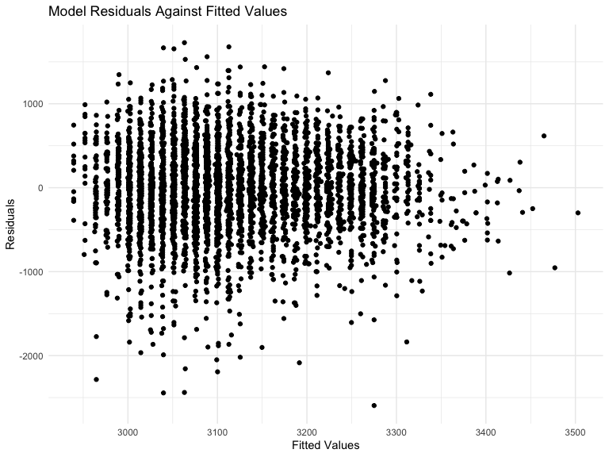
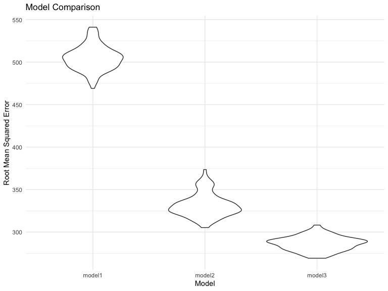

p8105\_hw6\_mm5351
================
Martha Mulugeta
11/15/2019

**Problem 1**

``` r
birthweight_data = 
  read_csv("./Data/birthweight.csv") %>% 
  janitor::clean_names() %>% 
  mutate(
    babysex = recode(babysex, 
              "1" = "male", 
              "2" = "female"),
  babysex = as.factor(babysex),
  frace = recode(frace,
                 "1" = "White",
                 "2" = "Black",
                 "3" = "Asian",
                 "4" = "Puerto Rican",
                 "8" = "Other",
                 "9" = "Unknown"),
  frace = as.factor(frace),
  malform = recode(malform,
                   "0" = "absent",
                   "1" = "present"),
  malform = as.factor(malform),
  mrace = recode(mrace,
                 "1" = "White",
                 "2" = "Black",
                 "3" = "Asian",
                 "4" = "Puerto Rican",
                 "8" = "Other"),
  mrace = as.factor(mrace)) %>% 
  na.omit()
```

    ## Parsed with column specification:
    ## cols(
    ##   .default = col_double()
    ## )

    ## See spec(...) for full column specifications.

The proposed regression model for birthweight includes two predictors:
family monthly inclome (fincome) and mother’s age at delivery (momage).
This model will be referred to as model1.

``` r
model1 = lm(bwt ~ fincome + momage, data = birthweight_data) 

model1 %>% 
  broom::tidy() %>% 
  select(term, estimate, p.value) %>% 
  knitr::kable(digits = 2)
```

| term        | estimate | p.value |
| :---------- | -------: | ------: |
| (Intercept) |  2749.99 |       0 |
| fincome     |     2.44 |       0 |
| momage      |    12.66 |       0 |

``` r
modelr::add_residuals(birthweight_data, model1) %>% 
modelr::add_predictions(model1) %>% 
ggplot(aes(x = pred, y = resid)) +
  geom_point() +
  labs(
    title = "Model Residuals Against Fitted Values",
    x = "Fitted Values",
    y = "Residuals")
```



The above plot represents the model residuals against fitted values. For
the relationship to fit the assumption of linearity, we would expect the
residuals to hover around the 0 value. While this is where most of the
values exist, outliers are present.

The model previously depicted (model1) will now be compared with two
other models for birthweight. The predictors in model2 include baby’s
length at birth (blength) and gestational age (gaweeks), only looking at
the main effects. The predictors in model3 include baby’s head
circumference (bhead), length at birth (blength), sex (babysex), and all
of the corresponding interactions.

``` r
model2 = 
  lm(bwt ~ blength + gaweeks, data = birthweight_data) %>% 
  broom::tidy()

model3 = 
  lm(bwt ~ bhead + blength + babysex + bhead * blength + bhead * babysex + blength * babysex + bhead * blength * babysex, data = birthweight_data) %>% 
  broom::tidy()
```

``` r
cv_df = 
  crossv_mc(birthweight_data, 100)

cv_df %>% pull(train) %>% .[[1]] %>% as_tibble
```

    ## # A tibble: 3,473 x 20
    ##    babysex bhead blength   bwt delwt fincome frace gaweeks malform menarche
    ##    <fct>   <dbl>   <dbl> <dbl> <dbl>   <dbl> <fct>   <dbl> <fct>      <dbl>
    ##  1 female     34      51  3629   177      35 White    39.9 absent        13
    ##  2 male       34      48  3062   156      65 Black    25.9 absent        14
    ##  3 female     36      50  3345   148      85 White    39.9 absent        12
    ##  4 male       34      52  3062   157      55 White    40   absent        14
    ##  5 female     34      52  3374   156       5 White    41.6 absent        13
    ##  6 female     33      46  2523   126      96 Black    40.3 absent        14
    ##  7 male       36      52  3515   146      85 White    40.3 absent        11
    ##  8 male       33      50  3459   169      75 Black    40.7 absent        12
    ##  9 female     35      51  3317   130      55 White    43.4 absent        13
    ## 10 male       35      51  3459   146      55 White    39.4 absent        12
    ## # … with 3,463 more rows, and 10 more variables: mheight <dbl>,
    ## #   momage <dbl>, mrace <fct>, parity <dbl>, pnumlbw <dbl>, pnumsga <dbl>,
    ## #   ppbmi <dbl>, ppwt <dbl>, smoken <dbl>, wtgain <dbl>

``` r
cv_df %>% pull(test) %>% .[[1]] %>% as_tibble
```

    ## # A tibble: 869 x 20
    ##    babysex bhead blength   bwt delwt fincome frace gaweeks malform menarche
    ##    <fct>   <dbl>   <dbl> <dbl> <dbl>   <dbl> <fct>   <dbl> <fct>      <dbl>
    ##  1 male       33      52  3374   129      55 White    40.7 absent        12
    ##  2 female     33      49  2778   140       5 White    37.4 absent        12
    ##  3 female     35      48  3175   158      75 White    39.7 absent        13
    ##  4 female     35      53  3345   127      65 Black    39.7 absent        14
    ##  5 male       34      63  3175   143      25 White    41.9 absent        13
    ##  6 female     35      52  3289   135      55 White    40.6 absent        13
    ##  7 male       35      52  3232   121      75 Asian    42.3 absent        13
    ##  8 female     34      49  2948   135      75 White    42.7 absent        12
    ##  9 male       34      52  3118   130      75 White    41   absent        12
    ## 10 male       33      50  3175   168      25 White    40   absent        13
    ## # … with 859 more rows, and 10 more variables: mheight <dbl>,
    ## #   momage <dbl>, mrace <fct>, parity <dbl>, pnumlbw <dbl>, pnumsga <dbl>,
    ## #   ppbmi <dbl>, ppwt <dbl>, smoken <dbl>, wtgain <dbl>

``` r
cv_df =
  cv_df %>% 
  mutate(
    train = map(train, as_tibble),
    test = map(test, as_tibble))

cv_df = 
  cv_df %>% 
  mutate(model1  = map(train, ~lm(bwt ~ fincome + momage, data = birthweight_data)),
         model2  = map(train, ~lm(bwt ~ blength + gaweeks, data = birthweight_data)),
         model3  = map(train, ~ lm(bwt ~ bhead + blength + babysex + bhead * blength + bhead * babysex + blength * babysex + bhead * blength * babysex, data = birthweight_data))) %>% 
  mutate(rmse_model1 = map2_dbl(model1, test, ~rmse(model = .x, data = .y)),
         rmse_model2 = map2_dbl(model2, test, ~rmse(model = .x, data = .y)),
         rmse_model3 = map2_dbl(model3, test, ~rmse(model = .x, data = .y)))
```

``` r
cv_df %>% 
  select(starts_with("rmse")) %>% 
  pivot_longer(
    everything(),
    names_to = "model", 
    values_to = "rmse",
    names_prefix = "rmse_") %>% 
  mutate(model = fct_inorder(model)) %>% 
  ggplot(aes(x = model, y = rmse)) + 
    geom_violin() +
    labs(
      title = "Model Comparison",
      x = "Model",
      y = "Root Mean Squared Error")
```



The above figure compares the three models based on the root mean
squared errors (RMSEs). The RMSEs indicate absolute measure of fit, such
that a lower value indicates better fit. Based on this, it is evident
that model3 is the best fitting model, followed by model2, and then
model1.

***Problem 2***

``` r
weather_df = 
  rnoaa::meteo_pull_monitors(
    c("USW00094728"),
    var = c("PRCP", "TMIN", "TMAX"), 
    date_min = "2017-01-01",
    date_max = "2017-12-31") %>%
  mutate(
    name = recode(id, USW00094728 = "CentralPark_NY"),
    tmin = tmin / 10,
    tmax = tmax / 10) %>%
  select(name, id, everything())
```

    ## Registered S3 method overwritten by 'crul':
    ##   method                 from
    ##   as.character.form_file httr

    ## Registered S3 method overwritten by 'hoardr':
    ##   method           from
    ##   print.cache_info httr

    ## file path:          /Users/marthamulugeta/Library/Caches/rnoaa/ghcnd/USW00094728.dly

    ## file last updated:  2019-09-26 10:25:45

    ## file min/max dates: 1869-01-01 / 2019-09-30

``` r
bootstrap_rsquared = 
  weather_df %>%
  modelr::bootstrap(n = 5000) %>%
  mutate(
    models = map(strap, ~ lm(tmax ~ tmin, data = .x)),
    results = map(models, broom::glance)) %>% 
  select(results) %>% 
  unnest(results) %>% 
  mutate(
    lower = quantile(r.squared, 0.025),
    upper = quantile(r.squared, 0.975),
    lower = round(lower, digits = 2),
    upper = round(upper, digits = 2)
  ) %>% 
  select(lower, upper) %>% 
  distinct()
```

The 95% confidence interval for r-squared is between 0.89 and 0.93.

``` r
bootstrap_log = 
  weather_df %>%
  modelr::bootstrap(n = 5000) %>%
  mutate(
    models = map(strap, ~ lm(tmax ~ tmin, data = .x)),
    results = map(models, broom::tidy)) %>% 
  select(results) %>% 
  unnest(results) %>%
  select(term, estimate) %>% 
  pivot_wider(
    names_from = term,
    values_from = estimate
  ) %>% 
  unnest() %>% 
  rename("intercept" = "(Intercept)") %>% 
  mutate(logb0b1 = log(intercept * tmin),
    lower = quantile(logb0b1, 0.025),
    upper = quantile(logb0b1, 0.975), 
    lower = round(lower, digits = 2),
    upper = round(upper, digits = 2)
  ) %>% 
  select(lower, upper) %>% 
  distinct()
```

The 95% confidence interval for log(b0 \* b1) is between 1.97 and 2.06.
